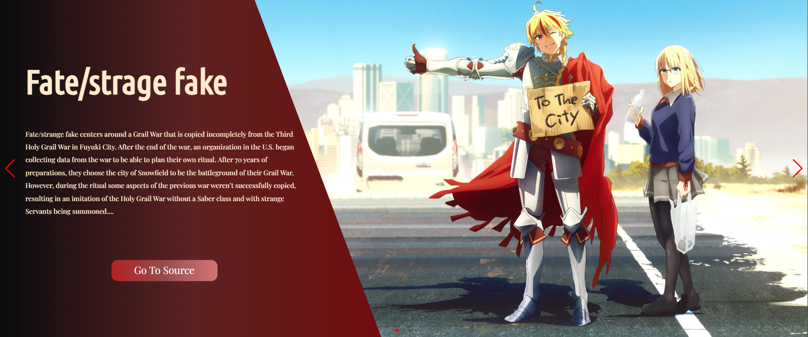
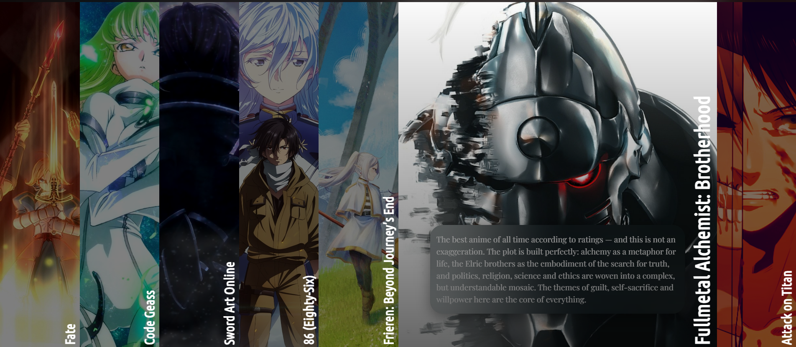
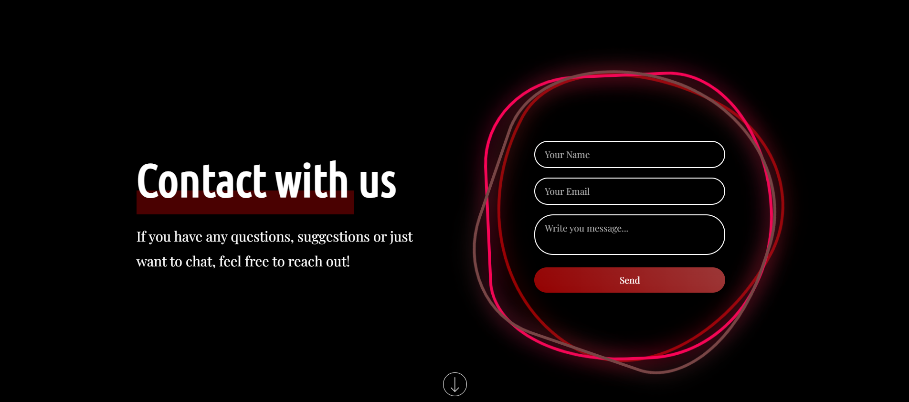

<h2 id="overview">Heizuke-List 📝</h2>

> **Heizuke-List** is a small curated website featuring the best anime series I recommend everyone to watch. The project offers a modern design, responsive layout, and interactive features.

---

<h2 id="overview">Table of Contents 📝</h2>

- [Overview](#overview-)
- [Features](#features-)
- [Technologies](#technologies-)
- [Installation](#installation-)
- [Usage](#usage-)
- [Examples](#examples-)
- [Project Structure](#project-structure-)
- [Author](#author-)
- [License](#license-)

---

<h2 id="overview">Overview 📝</h2>

**Heizuke-List** is a personal selection of anime with short descriptions, interactive lists, and a release slider. The site is fully static, requires no backend, and is perfect for discovering top anime recommendations.

---

<h2 id="overview">Features ⚙️</h2>

- **Release slider** (Swiper.js) with navigation and autoplay.
- **Fact list** about the site and image sources.
- **Top anime list** with interactive selection and detailed descriptions.
- **Responsive design** for all devices.
- **Smooth scrolling** to sections.
- **Contact form** (UI only, no backend).
- **Custom navigation** with mobile menu.
- **Modern styling** using modular CSS.

---

<h2 id="overview">Technologies 🛠️</h2>

- **HTML5**
- **CSS3** 
- **JavaScript** 
- **Swiper.js**
- **Google Fonts**

---

<h2 id="overview">Installation 🚀</h2>

1. **Clone the repository:**
   ```sh
   git clone https://github.com/DmyTROSAlii/Heizuke-List.git
   ```
2. **Open the folder in your browser:**
   - Simply open `index.html` in your browser.
   - Or use a local server (e.g., [Live Server](https://marketplace.visualstudio.com/items?itemName=ritwickdey.LiveServer) in VS Code).

---

<h2 id="overview">Usage ▶️</h2>

- Navigate between sections using the menu.
- Browse releases in the slider.
- Click on an anime in the top list to view its description.
- Use the contact form for feedback (UI only).

---

<h2 id="overview">Examples 💡</h2>

- **Release slider:**
  
- **Top anime:**
  
- **Contact form:**
  

---

<h2 id="overview">Project Structure 📚<h2>

```
index.html
css/
  style.css
  components/
  sections/
img/
js/
  swiper.js
  click-list.js
  scroll-to.js
```

---

<h2 id="overview">License 📄</h2>

All rights reserved © 2025
